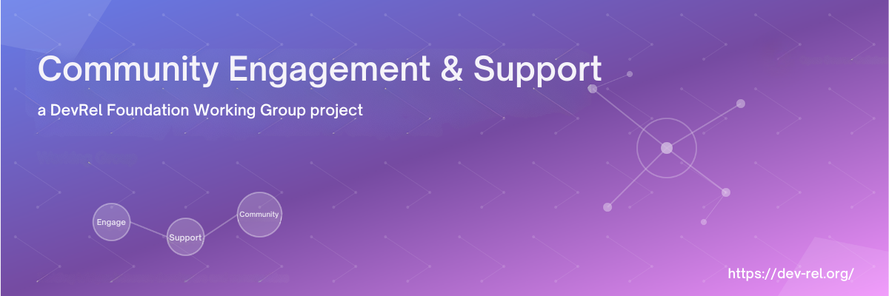

<h1 align="center" style="border-bottom: none">
    Community Engagement & Support
</h1>

Welcome to the Developer Relations Foundation's Community Engagement & Support working group repository. This working group focuses on developing frameworks, strategies, and best practices for building thriving developer communities through meaningful engagement, comprehensive support systems, and sustainable community growth.

## Our mission

To establish standardized approaches and resources that enable organizations to build, nurture, and scale developer communities that drive mutual value for both developers and organizations through authentic engagement and robust support ecosystems.

## Working group objectives

- Create reusable templates and frameworks for community engagement and support strategies
- Establish industry standards for community engagement across different organizational contexts
- Develop tools and templates that can be immediately implemented by DevRel professionals
- Foster collaboration and learning within the broader DevRel community

## Repo structure
All directories listed are intended to serve as a set of resource you may utilize when building a new Developer Community program, or evolving an existing one. Read through each and use them as appropriate and necessary for your organization or vertical. Not all may be required to fulfill your goals right away. Keep this project bookmarked as a resource for the future. 

- [examples/](./examples/)
  - [case studies/](./examples/case-studes/)
  - [implementation examples/](./examples/implementation-examples/)
- [frameworks/](./frameworks/)
  - [community maturity model](./frameworks/community_maturity_model.md)
  - [engagement metrics](./frameworks/engagement_metrics.md)
  - [support tiers](./frameworks/support_tiers.md)
- [resources/](./resources/)
  - [templates/](./resources/templates/)
  - [tools](./resources/tools/TOOLS_README.md)
- [strategy/](./strategy/)
  - [30 60 90 day plan](./strategy/30_60_90_day_plan.md)
  - [community strategy](./strategy/community_strategy.md)
  - [continuous improvement process](./strategy/continuous_improvement_process.md)
  - [journey map](./strategy/journey_map.md)
  - [okr framework](./strategy/okr_framework.md)
  - [resource allocation budget](./strategy/resource_allocation_budget.md)
  - [risk assessment mitigation](./strategy/risk_assessment_mitigation.md)
  - [stakeholder alignment](./strategy/stakeholder_alignment.md)
  - [success measures](./strategy/success_measures.md)
- [tactics/](./tactics/)
  - [engagement campaigns/](./tactics/engagement-campaigns/)
  - [support-playbooks/](./tactics/support-playbooks/)
  - [community engagement tactics](./tactics/community_engagement_tactics.md)

## Key docs
- **[Community engagement strategy _template_](./strategy/community_strategy.md)**: Comprehensive framework for developing community engagement strategies using OKR methodology
- **[Community engagement tactics _template_](./tactics/community_engagement_tactics.md)**: Tactical implementation guide supporting strategic objectives

## Getting started

### For DevRel professionals
1. Review the [Community engagement strategy template](./strategy/community_strategy.md) to understand the strategic framework
2. Explore the [Tactics template](./tactics/community_engagement_tactics.md) for implementation guidance
3. Adapt the [templates](./resources/templates/) to your organization's specific needs and context

## License

This work is [licensed](./LICENSE) under [Creative Commons Attribution 4.0 International License](https://creativecommons.org/licenses/by/4.0/). You are free to use, modify, and distribute these resources with appropriate attribution.

## Acknowledgments

Special thanks to all working group members, contributors, and the broader DevRel Foundation community for their ongoing support and collaboration in advancing developer community engagement practices.

---

**Questions?** Open an [Issue](https://github.com/DevRel-Foundation/wg-community-engagement-support/issues) in this repository or reach out to the working-group leadership team in [Discord](https://discord.gg/ukMnmFjw43), <mark>🌱community-updates</mark> channel.