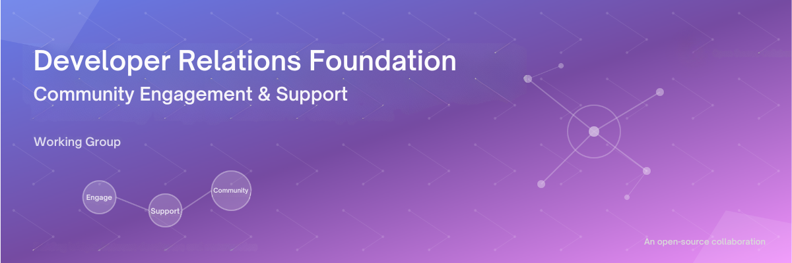

<h1 align="center" style="border-bottom: none">
    Community Engagement & Support
</h1>

Welcome to the Developer Relations Foundation's Community Engagement & Support Working Group repository. This working group focuses on developing frameworks, strategies, and best practices for building thriving developer communities through meaningful engagement, comprehensive support systems, and sustainable community growth.

## Mission statement

To establish standardized approaches and resources that enable organizations to build, nurture, and scale developer communities that drive mutual value for both developers and organizations through authentic engagement and robust support ecosystems.

## Working group objectives

### Primary goals
- **Framework development**: Create reusable templates and frameworks for community engagement and support strategies
- **Best practice documentation**: Establish industry standards for community engagement across different organizational contexts
- **Resource creation**: Develop tools and templates that can be immediately implemented by DevRel professionals
- **Knowledge sharing**: Foster collaboration and learning within the broader DevRel community

### Key deliverables
- Strategic planning templates and frameworks
- Tactical implementation guides
- Measurement and analytics frameworks
- Community support process documentation
- Onboarding and engagement playbooks

## Repository structure

- README
- [CONTRIBUTING](./CONTRIBUTING.md)
- [CHARTER](./CHARTER.md)
- [GOALS](GOALS.md)
- [examples/](./examples/)
  - [case studies/](./examples/case-studes/)
  - [implementation examples/](./examples/implementation-examples/)
- [frameworks/](./frameworks/)
  - [community maturity model](./frameworks/community-maturity-model.md)
  - [engagement metrics](./frameworks/engagement-metrics.md)
  - [support tiers](./frameworks/support-tiers.md)
- [resources/](./resources/)
  - [templates/](./resources/templates/)
  - [tools/](./resources/tools/)
- [strategy/](./strategy/)
  - [30 60 90 day plan](./strategy/30-60-90-day-plan.md)
  - [community strategy](./strategy/community_strategy.md)
  - [continuous improvement process](./strategy/continuous-improvement-process.md)
  - [journey map](./strategy/journey-map.md)
  - [okr framework](./strategy/okr-framework.md)
  - [resource allocation budget](./strategy/resource-allocation-budget.md)
  - [risk assessment mitigation](./strategy/risk-assessment-mitigation.md)
  - [stakeholder alignment](./strategy/stakeholder-alignment.md)
  - [success measures](./strategy/success-measures.md)
- [tactics/](./tactics/)
  - [engagement campaigns/](./tactics/engagement-campaigns/)
  - [support-playbooks/](./tactics/support-playbooks/)
  - [community engagement tactics](./tactics/community_engagement_tactics.md)

## Key documents

### Strategic planning
- **[Community engagement strategy _template_](./strategy/community_strategy.md)**: Comprehensive framework for developing community engagement strategies using OKR methodology
- **[Community engagement tactics _template_](./tactics/community_engagement_tactics.md)**: Tactical implementation guide supporting strategic objectives

### Contribution guidelines
- **[Contributing guide](./CONTRIBUTING.md)**: How to contribute to this working group's efforts

## Getting started

### For DevRel professionals
1. Review the [Community engagement strategy template](./strategy/community_strategy.md) to understand the strategic framework
2. Explore the [Tactics template](./tactics/community_engagement_tactics.md) for implementation guidance
3. Adapt the [templates](./resources/templates/) to your organization's specific needs and context

### For contributors
1. Read our [Contributing guidelines](./CONTRIBUTING.md)
2. Join our working group discussions (see [Communication channels](#communication-channels) below)
3. Review [open issues](https://github.com/DevRel-Foundation/wg-community-engagement-support/issues) and identify areas where you can contribute

## Communication channels

- **Working group meetings**: _TBD_
- **Discord**: 🙋community-engage-support in [DevRel Foundation Discord](https://discord.gg/ukMnmFjw43)
- **Discussion forum**: [GitHub Discussions](https://github.com/DevRel-Foundation/wg-community-engagement-support/discussions) in this repository
- **Mailing list**: [https://lists.dev-rel.org/g/wg-community-engagement-support/](https://lists.dev-rel.org/g/wg-community-engagement-support/)

## Current focus areas

### Q1 2025 priorities
- [ ] Finalize community engagement strategy _template_ v1.0
- [ ] Complete tactics implementation framework
- [ ] Develop community maturity assessment model
- [ ] Create measurement and analytics framework

### Upcoming initiatives
- Community support tier framework
- Developer journey mapping templates
- Cross-platform engagement strategies
- Community health metrics dashboard

## Working group leadership

**Working group lead**: [Your Name]
- GitHub: [@yourusername]
- Email: your.email@company.com
- Focus: Strategic framework development, community building

**Co-lead**: [To be appointed]
- Focus: Tactical implementation, process optimization

## How to use these resources

### Organizations looking to improve community engagement
1. Start with the strategy template to establish clear objectives
2. Use the tactics document to plan specific implementation approaches
3. Adapt frameworks to your community's unique characteristics and needs
4. Contribute back lessons learned and improvements

### Individual contributors
1. Review documentation and provide feedback through GitHub issues
2. Share case studies and real-world implementation examples
3. Contribute new templates, tools, or framework enhancements
4. Participate in working group discussions and planning sessions

## Success metrics

We measure our working group's success through:
- **Adoption rate**: Number of organizations implementing our frameworks
- **Community engagement**: Active participation in discussions and contributions
- **Content quality**: Feedback scores and iteration cycles on deliverables
- **Industry impact**: Recognition and reference by DevRel professionals and organizations

## License

This work is [licensed](./LICENSE) under [Creative Commons Attribution 4.0 International License](https://creativecommons.org/licenses/by/4.0/). You are free to use, modify, and distribute these resources with appropriate attribution.

## Acknowledgments

Special thanks to all working group members, contributors, and the broader DevRel Foundation community for their ongoing support and collaboration in advancing developer community engagement practices.

---

**Questions?** Open an [Issue](https://github.com/DevRel-Foundation/wg-community-engagement-support/issues) in this repository or reach out to the working-group leadership team in [Discord](https://discord.gg/ukMnmFjw43), <mark>🌱community-updates</mark> channel.