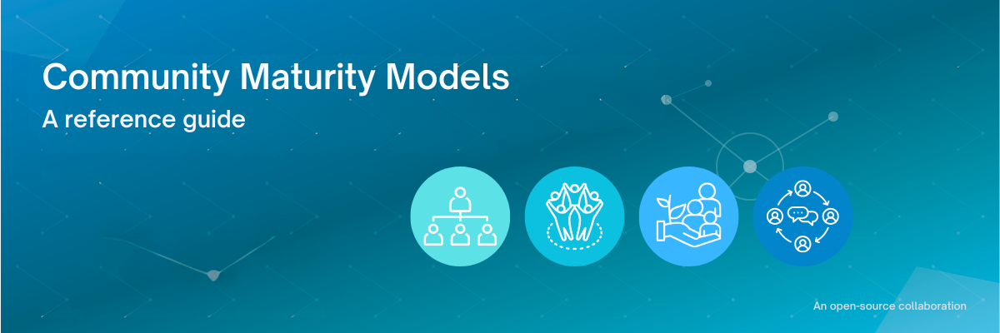

<h1 align="center" style="border-bottom: none">
    Community Maturity Models
</h1>

## Overview

Community Maturity Models are frameworks that help organizations understand, assess, and improve their community programs over time. They provide structured approaches to evaluate where your community currently stands and identify the next steps in your community development journey. This guide presents the most commonly used and well-established Community Maturity Models to help you choose the right framework for your organization.

## Why Use a Community Maturity Model?

Community Maturity Models serve several critical functions:

- **Benchmarking**: Assess your current community program's effectiveness and maturity level
- **Strategic Planning**: Create roadmaps for community development and resource allocation
- **Standardization**: Establish common language and expectations across your organization
- **Measurement**: Track progress and demonstrate ROI to stakeholders
- **Innovation Framework**: Provide structure within which to experiment and improve
- **Resource Optimization**: Identify where to focus efforts for maximum impact

## Suggested Community Maturity Models

### The Community Roundtable's Community Maturity Model™ (CMM)

**Developer**: [The Community Roundtable (2009, updated 2019)](https://communityroundtable.com/what-we-do/research/community-maturity-model/)
**License**: Creative Commons Attribution-NonCommercial-NoDerivatives 4.0 International
**Attribution Required**: "Community Maturity Model™ by The Community Roundtable is licensed under a Creative Commons Attribution-NonCommercial-NoDerivatives 4.0 International License. Based on a work at https://communityroundtable.com/what-we-do/research/community-maturity-model/"

**Overview**: The most widely referenced and adopted framework in the industry. This model helps organizations understand, plan for, and assess the performance of online community initiatives.

#### Four maturity stages

**Stage 1 (CMM1) - Emergent**
- Organizations range from those relatively untouched by social technologies to those with chaotic, inconsistent approaches
- Some usage and experimentation with social tools and techniques (formal or informal)
- Limited coordination between different teams and technologies

**Stage 2 (CMM2) - Established** 
- Organizations focus on organizing, assessing opportunity, research, and marshaling resources
- Development of operational approaches and resource allocation
- Defined budgets, community management resources, and policies
- Increased investment in infrastructure, tools, and teams

**Stage 3 (CMM3) - Maturing**
- Organizations see meaningful business returns at scale
- Focus shifts to sustaining and managing growth
- Decision point: discrete business goals vs. broader business strategy integration
- Risk of de-prioritizing community management due to member self-management

**Stage 4 (CMM4) - Networked**
- Major philosophical, cultural, and structural organizational changes
- Networked approach integrating employee, customer, partner constituencies
- Default mode of sharing and openness rather than proprietary approaches
- All management resembles community management with coaching and facilitation

#### Eight core competencies:
The model defines eight competencies required for successful community management (specific competencies available through The Community Roundtable's detailed resources).

**Best for**: Organizations seeking a comprehensive, industry-standard framework with extensive supporting resources and benchmarking capabilities.

**Access**: Free assessment tool available; detailed resources require subscription.

---

### Gongla and Rizzuto Community Evolution Model

**Developer**: [Gongla and Rizzuto (2001)](https://ieeexplore.ieee.org/document/5386943)
**Publication**: "Evolving communities of practice: IBM Global Services experience." IBM Systems Journal, 40(4), 842-862.
**Copyright**: Traditional academic copyright - fair use applies for educational and research purposes
**Attribution required**: Full academic citation when referencing this model

**Overview**: A five-stage model focusing on community evolution with detailed perspectives on people, processes, and technology.

#### Five maturity stages:
1. **Potential** - Early formation and identification of community possibility
2. **Building** - Active development of community structure and engagement
3. **Engaged** - Members actively participating and contributing
4. **Active** - High levels of collaboration and knowledge sharing
5. **Adaptive** - Self-organizing and evolving community capabilities

#### Three assessment perspectives:
- **People behavior**: How community members interact and engage
- **Process support**: Degree and type of formal/informal processes
- **Technology**: Types and sophistication of technological tools used

**Best for**: Organizations wanting detailed analysis of community evolution across multiple dimensions, particularly useful for understanding the relationship between people, processes, and technology.

---

### Lee et al. Community of Practice Maturity Model

**Developer**: Lee, Suh, and Hong (2010)
**Publication**: "A maturity model based CoP evaluation framework: A case study of strategic CoPs in a Korean company." Expert Systems with Applications, 37(4), 2670-2681.
**Copyright**: Traditional academic copyright - fair use applies for educational and research purposes
**Attribution required**: Full academic citation when referencing this model

**Overview**: A four-stage model designed specifically for Communities of Practice with focus on critical success factors.

#### Four maturity stages:
1. **Building** - Initial community formation and structure development
2. **Growth** - Expanding membership and increasing activity levels
3. **Adaptive** - Self-organizing capabilities and responsive to member needs
4. **Close** - Natural conclusion or transformation of community lifecycle

**Assessment method**: Provides snapshot of current maturity level based on critical success factors analysis.

**Best for**: Organizations with Communities of Practice that want to understand natural community lifecycle progression and critical success factors at each stage.

---

### Community Maturity Model for Knowledge Management (CoMM)

**Developer**: Developed through Focus Group meetings with KM experts
**Publication**: Multiple academic publications available through ResearchGate and academic databases
**Copyright**: Traditional academic copyright - fair use applies for educational and research purposes
**Attribution required**: Full academic citation of specific research papers when referencing this model

**Overview**: Specifically designed to assess knowledge management capabilities within communities, focusing on participation, collaboration, and decision-making.

#### Key assessment areas:
- **Members' participation**: Level and quality of member engagement
- **Collaboration effectiveness**: How well members work together
- **Decision-Making processes**: Community governance and consensus-building
- **Knowledge management capacity**: Ability to capture, share, and create knowledge

**Best for**: Organizations where community serves primarily as a knowledge management tool or where knowledge sharing is the primary community objective.

---

### Tacit's Community of Practice Maturity Model

**Developer**: Tacit (based on multi-year research across organizations)
**License**: Free PDF resource available (specific license terms should be verified)
**Attribution required**: Credit Tacit as developer and source
**Access**: Available at hellotacit.com/community-of-practice-maturity-model/

**Overview**: Identifies different phases of community development with specific focus on progression toward self-sustaining communities.

**Key features**:
- Research-backed framework based on real organizational experiences
- Emphasizes path to self-sustainability
- Practical guidance for community progression
- Available as free PDF resource

**Best for**: Organizations developing Communities of Practice with emphasis on achieving self-sustaining community operations.

---

### UNICEF's Community Maturity Framework

**Developer**: UNICEF (based on The Community Roundtable model)
**License**: Restricted access - available only to UNICEF staff
**Attribution required**: Credit both UNICEF as developer and The Community Roundtable as foundational model
**Access**: Internal UNICEF resource only

**Overview**: Adapted framework specifically designed for measuring community groups' evolution and generating evidence of participation value.

#### Structure:
- **Four maturity stages**: Modified from The Community Roundtable model
- **Ten capability dimensions**: Specific areas of community capability assessment
- **Community scorecard**: Excel-based assessment tool for community managers and group leaders

**Best for**: Organizations in non-profit, social impact, or development sectors looking for a model adapted for measuring community participation value and social outcomes.

## Choosing the right model for your organization

### Consider these factors:

**Community type**
- **Corporate/Business communities**: The Community Roundtable CMM
- **Communities of practice**: Lee et al. or Tacit models
- **Knowledge-focused communities**: CoMM
- **Social impact communities**: UNICEF Framework

**Organizational context**
- **Established organizations**: The Community Roundtable CMM for comprehensive assessment
- **Startups/Early stage**: Gongla and Rizzuto for understanding evolution
- **Non-Profit/Social sector**: UNICEF Framework

**Assessment depth**
- **Comprehensive evaluation**: The Community Roundtable CMM
- **Multi-dimensional analysis**: Gongla and Rizzuto
- **Lifecycle focus**: Lee et al. model
- **Knowledge management focus**: CoMM

**Resource requirements**
- **Free resources**: Tacit, UNICEF (for eligible organizations)
- **Premium resources**: The Community Roundtable (subscription-based detailed resources)
- **Academic/Research**: CoMM, Gongla and Rizzuto

## Implementation recommendations

### Getting started

1. **Assessment**
   - Choose the model that best fits your community type and organizational context
   - Conduct initial maturity assessment using your selected framework
   - Document current state across all model dimensions

2. **Planning**
   - Identify gaps between current and desired maturity levels
   - Prioritize areas for improvement based on organizational goals
   - Develop action plans with specific, measurable objectives

3. **Implementation**
   - Execute improvement initiatives systematically
   - Monitor progress using model metrics
   - Adjust strategies based on results and feedback

4. **Evolve**
   - Regularly reassess maturity levels (quarterly or bi-annually)
   - Update strategies based on organizational changes
   - Share learnings with broader community management networks

### Best practices

- **Start simple**: Begin with basic assessment before diving deep into complex frameworks
- **Involve stakeholders**: Include community members, leadership, and cross-functional teams in assessment
- **Focus on action**: Use assessment results to drive specific improvements, not just measurement
- **Regular review**: Maturity models are most valuable when used consistently over time
- **Adapt as needed**: Modify frameworks to fit your specific organizational context and needs

## Modern trends in Community Maturity Assessment

### Multi-dimensional frameworks
Organizations increasingly use multiple maturity models together to assess various capabilities simultaneously, rather than relying on single models in isolation. This approach provides more comprehensive insights across different aspects of community management.

### Integration with business strategy
Modern applications of maturity models emphasize integration with broader business strategy rather than treating community as an isolated function.

### Continuous assessment
Organizations are moving toward continuous assessment approaches rather than annual or periodic evaluations, using real-time metrics and feedback loops.

## Resources and further reading

### Primary sources
- **The Community Roundtable**: [communityroundtable.com](https://communityroundtable.com/what-we-do/research/community-maturity-model/)
- **Tacit Community of Practice Model**: [hellotacit.com](https://hellotacit.com/community-of-practice-maturity-model/)
- **Academic research**: Available through ResearchGate and academic databases

### Assessment tools
- The Community Roundtable Community Score (free basic assessment)
- UNICEF Community Scorecard (Excel-based, for eligible organizations)
- Custom assessment frameworks (developed internally or with consultants)

## Legal and attribution guidelines

### Understanding copyright and fair use

**Academic research**: Academic research that references and discusses these models generally falls under fair use provisions for "criticism, comment, news reporting, teaching, scholarship, or research". However, this must be transformative and educational in nature.

**Attribution requirements**:
- Always provide full, proper citations for academic models
- Follow Creative Commons license requirements exactly where applicable
- Distinguish between referencing/discussing a model and implementing/adapting it
- When in doubt, seek permission from copyright holders

**Compliance recommendations**:
- Use models for reference and guidance rather than direct reproduction
- Provide proper attribution in all cases
- Limit excerpts to what's necessary for educational purposes
- Consider developing your own assessment framework inspired by, but not derivative of, existing models

### For commercial use

Organizations planning to use these models commercially should:
- Contact copyright holders directly for permission
- Consider licensing fees where applicable
- Develop original frameworks inspired by these models rather than direct adaptations
- Consult with legal counsel for specific use cases

This guide is maintained by the [Developer Relations Foundation Community Working Group](https://github.com/DevRel-Foundation/wg-community-engagement-support). To suggest updates, corrections, or additional models:

1. Review the current content for accuracy and completeness
2. Submit issues or pull requests to the repository
3. Participate in working group discussions about community maturity frameworks
4. Share your experiences implementing these models in real-world contexts

## Wrap-up

Community Maturity Models provide essential frameworks for understanding and improving community programs. Choose the model that best aligns with your community type, organizational context, and assessment needs. Remember that these models are tools to guide improvement, not rigid prescriptions. Adapt them to your specific situation and use them consistently to drive meaningful community development over time.

The key to success with any maturity model is regular assessment, strategic planning based on results, and systematic implementation of improvements. Whether you're building a new community program or evolving an existing one, these frameworks can provide valuable structure and guidance for your community development journey.